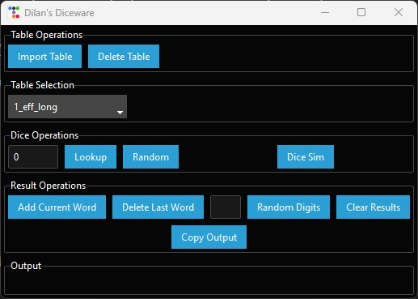
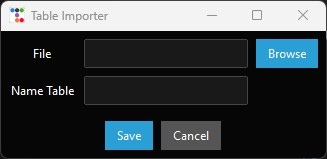
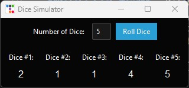

# Introduction

This is a diceware application I built using Python, SQLite3, ttkbootstrap, and EFF's dicelist text files.

Note: This can only be used for the wordlists which are for 6-sided dice where each line is like "1111  word". If you want to use custom word lists, please format it this way in your files. The number of spaces between the sequence and words doesn't really matter, Python's strip command only needs some whitespace.

# How to use

## Prerequisites

### Python
Can be installed depending on platform

Windows:

Install by executable at [main Python.org website](https://www.python.org/downloads/windows/)

Linux:

It maybe installed by default. If not install it with your distribution's package manager for example: (May need to know some troubleshooting for this)

Arch: `pacman -S python3 python3-pip`

Ubuntu/Debian: `apt install python3 python3-pip`

Redhat/Fedora: `dnf install python3 python3-pip`

### ttkbootstrap

Once Python and pip are installed, you can install ttkbootstrap using the following:

Windows:

`pip install ttkbootstrap`

Linux:

`pip3 install ttkbootstrap`

## Installation

Clone this repo into the directory of your choice, by either downloading the zip and extracting into a directory of your choice, or using the git command to clone.

`git clone https://www.github.com/dbob16/diceware.git`

Navigate into the folder and run ***main*** script with Python:

`cd diceware`

Windows:
`python main.py`

Linux:
`python3 main.py`

Then the application should open in a new window.

## Actual Use

- **Import Table** - Brings up a dialog which allows you to import and name tables.
- **Delete Table** - Deletes the table which is selected.
- **Table Selection** - A dropdown which allows you to select the table lookup and random functions are performed against.
- **Lookup** - Looks up the word pertaining to the sequence of dice entered to the left, and puts it to the right of Random.
- **Random** - Looks up a random word in the currently selected table, displays it to the right.
- **Dice Sim** - Opens a dialog to simulate 6-sided dice.
- **Add Current Word** - Adds the word selected by Random to the Output list.
- **Delete Last Word** - Deletes the last word in the Output list.
- **Random Digits** - Allows you to put a number in the left of it and it will randomly generate that many digits and add it to the Output.
- **Clear Results** - Clears out the Output list
- **Copy** - Copies the Output list as-is.

In this dialog you just put the path or use the browse button to input the path of the text file containing the wordlist, put the table name in the box below (can't have apostrophes or quote marks), and then click Save. It will import it and save it as a table, it should show up in the dropdown as the name you put in.

The Dice Sim is pretty fun and simple. Just put in the amount of dice you want to roll and click Roll Dice. It will then spit out a number for each dice, which is randomly generated.